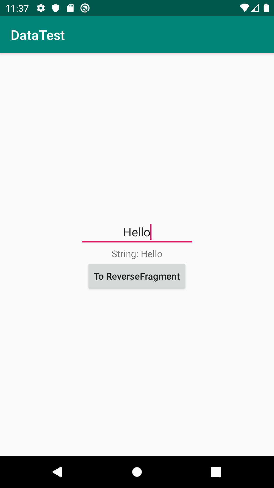
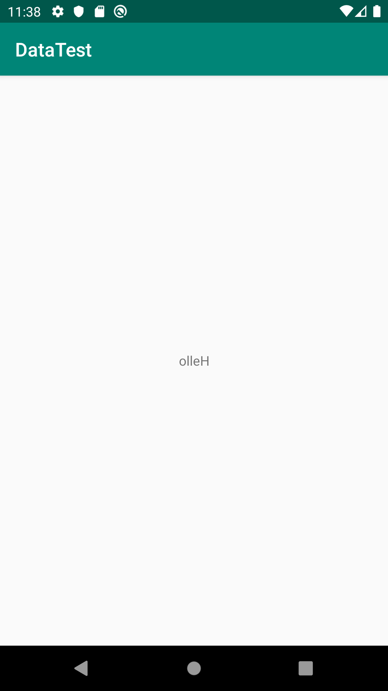

次の2つの事項について扱う。

1. DataBindingにおけるデータの受け渡し
2. Navigationを用いた、異なるFragment間におけるデータの受け渡し

さらに具体的に言うと、次の機能を持つアプリを作る

1. `MainFragment`にはEditTextが1つある。
2. EditTextが入力されると、TextViewが"String: [EditTextの文字列]"に変わる。
3. Buttonが押されると、`ReverseFragment`に遷移する
4. `ReverseFragment`は、`MainFragment`のテキストフィールドの文字列を受け取って、それを逆順にした文字列を表示する。

[Android Kotlin Fundamentals Course](https://codelabs.developers.google.com/android-kotlin-fundamentals/)での05辺りを勉強した記録なので、詳しいことはそちらに載っている。

## プロジェクト初期設定

"Empty Project"として作成して、名前を"DataTest"とする。

`build.gradle(module:App)`について、`dataBinding`の設定をしておく。

次のように`MainFragment`と`ReverseFragment`を作成しておく。作成時、"Create layout XML?"にのみチェックをつけておく。


## MainFragmentの設定

`fragment_main.xml`を次のようにする。


<?xml version="1.0" encoding="utf-8"?>
<layout xmlns:android="http://schemas.android.com/apk/res/android"
    xmlns:tools="http://schemas.android.com/tools"
    tools:context=".main.MainFragment">
    <data>
        <variable
            name="myMsg"
            type="com.example.datatest.main.MainFragment.MyMsg" />
    </data>
    <LinearLayout
        android:layout_width="match_parent"
        android:layout_height="wrap_content"
        android:orientation="vertical"
        android:layout_gravity="center_vertical" >
        <EditText
            android:id="@+id/edit_text"
            android:layout_width="wrap_content"
            android:layout_height="wrap_content"
            android:hint="@string/hello_blank_fragment"
            android:layout_gravity="center_horizontal"
            android:textAlignment="center" />
        <TextView
            android:id="@+id/text_view"
            android:layout_width="wrap_content"
            android:layout_height="wrap_content"
            android:text="@={myMsg.text}"
            android:layout_gravity="center_horizontal"
            android:textAlignment="center" />

        <Button
            android:id="@+id/button"
            android:layout_width="wrap_content"
            android:layout_height="wrap_content"
            android:layout_gravity="center_horizontal"
            android:text="@string/to_reverse_fragment"
            android:textAllCaps="false" />

    </LinearLayout>

</layout>


重要なのは以下の部分で、これは`MainFragment.kt`で定義された`MyMsg`というクラスのインスタンスをこのファイルでは`myMsg`として扱う、という意味。


    <data>
        <variable
            name="myMsg"
            type="com.example.datatest.main.MainFragment.MyMsg" />
    </data>


実際には、`@={variableで定義したname.メンバ}`という形でアクセスする。


        <TextView
            ...
            android:text="@={myMsg.text}"
            ... />


さて`MyMsg`というクラスを作っていないので、それも兼ねて`MainFragment.kt`の編集をする。以下のようにする。

`addTextChangedListener`を用いると、`EditText`の変化を捕捉できる。


class MainFragment : Fragment() {
    data class MyMsg(var text: String = "")
    private lateinit var binding: FragmentMainBinding
    override fun onCreateView(
        inflater: LayoutInflater, container: ViewGroup?,
        savedInstanceState: Bundle?
    ): View? {
        // Inflate the layout for this fragment
        binding = DataBindingUtil.inflate(inflater, R.layout.fragment_main, container, false)
        binding.myMsg = MyMsg("Hello")
        binding.editText.addTextChangedListener {
            binding.myMsg?.text = "String: " + it.toString()
            binding.invalidateAll()
        }
        return binding.root
    }
}


Kotlinでは、メンバ変数のみで作られたクラスを次のように簡潔に書ける。C言語におけるstructみたいなもの。


data class MyMsg(var text: String = "")


`main_fragment.xml`で定義した`variable`要素は以下の部分に対応している。`name`属性が`myMsg`だったので`binding.myMsg`でアクセスする。


binding.myMsg = MyMsg("Hello")


### (寄り道) apply関数の利用

`apply`を利用すると、`binding.[メンバ]`という書式が単に`[メンバ]`だけで記述できるようになる。このような関数を「スコープ関数」と呼ぶ。


class MainFragment : Fragment() {
    data class MyMsg(var text: String = "")
    private lateinit var binding: FragmentMainBinding
    override fun onCreateView(
        inflater: LayoutInflater, container: ViewGroup?,
        savedInstanceState: Bundle?
    ): View? {
        // Inflate the layout for this fragment
        binding = DataBindingUtil.inflate(inflater, R.layout.fragment_main, container, false)
        binding.apply {
            myMsg = MyMsg("Hello")
            editText.addTextChangedListener {
                myMsg?.text = "String: " + it.toString()
                invalidateAll()
            }
        }
        return binding.root
    }
}


### とりあえずのactivity_main.xml

`MainFragment`が正しく機能しているかどうか確認したいので、`activity_main.xml`を編集する。Navigationと連携させるときに書き直す。


<?xml version="1.0" encoding="utf-8"?>
<layout xmlns:android="http://schemas.android.com/apk/res/android"
    xmlns:app="http://schemas.android.com/apk/res-auto"
    xmlns:tools="http://schemas.android.com/tools"
    tools:context=".MainActivity">

    <LinearLayout
        android:layout_width="match_parent"
        android:layout_height="wrap_content"
        android:layout_gravity="center_vertical"
        android:orientation="vertical">

        <fragment
            android:id="@+id/myNavHostFragment"
            android:name="com.example.datatest.main.MainFragment"
            android:layout_width="match_parent"
            android:layout_height="wrap_content" />
    </LinearLayout>
</layout>


この時点でアプリを起動してみると、以下のようになる。EditTextに`abcd`を入力すると、その下に`String: abcd`と出力される 。



## Navigationの作成

とりあえず遷移できるところまで作る。

`fragment_reverse.xml`の内容を以下の通りにする。


<?xml version="1.0" encoding="utf-8"?>
<FrameLayout xmlns:android="http://schemas.android.com/apk/res/android"
    xmlns:tools="http://schemas.android.com/tools"
    android:layout_width="match_parent"
    android:layout_height="match_parent"
    tools:context=".reverse.ReverseFragment">

    <TextView
        android:id="@+id/reverse_text_view"
        android:layout_width="match_parent"
        android:layout_height="match_parent"
        android:text="@string/hello_blank_fragment" />

</FrameLayout>


`ReverseFragment.kt`については、とりあえず次のようにしておく。


class ReverseFragment : Fragment() {
    private lateinit var binding: FragmentReverseBinding
    override fun onCreateView(
        inflater: LayoutInflater, container: ViewGroup?,
        savedInstanceState: Bundle?
    ): View? {
        binding = DataBindingUtil.inflate(inflater, R.layout.fragment_reverse, container, false)
        return binding.root
    }
}


NavigationのResource Fileを作成する(詳しいことは(2)の記事で話した通り)。次に、`res/navigation/navigation.xml`の内容を以下の通りにする。`MainFragment`から`ReverseFragment`へ接続する。


<?xml version="1.0" encoding="utf-8"?>
<navigation xmlns:android="http://schemas.android.com/apk/res/android"
    xmlns:app="http://schemas.android.com/apk/res-auto"
    xmlns:tools="http://schemas.android.com/tools"
    android:id="@+id/navigation.xml"
    app:startDestination="@id/mainFragment">

    <fragment
        android:id="@+id/mainFragment"
        android:name="com.example.datatest.main.MainFragment"
        android:label="fragment_main"
        tools:layout="@layout/fragment_main" >
        <action
            android:id="@+id/action_mainFragment_to_reverseFragment"
            app:destination="@id/reverseFragment" />
    </fragment>
    <fragment
        android:id="@+id/reverseFragment"
        android:name="com.example.datatest.reverse.ReverseFragment"
        android:label="fragment_reverse"
        tools:layout="@layout/fragment_reverse" />
</navigation>


`MainFragment.kt`の`binding.apply { ... }`の部分を以下のように修正する。Buttonを押した時に遷移する。


binding.apply {
    myMsg = MyMsg("Hello")
    editText.addTextChangedListener {
        myMsg?.text = "String: " + it.toString()
        invalidateAll()
    }
    button.setOnClickListener {
        it.findNavController().navigate(R.id.action_mainFragment_to_reverseFragment)
    }
}


## Gradleの設定

### Safe Argsの有効化

異なるFragment間でデータのやり取りをする際、以前はBundleという形式で行っていたらしい。現在は、型安全な状態でデータを受け渡すことができるSafe Argsという仕組みがあるので、そちらを利用する。

`build.gradle(Project: ...)`の`buildscript-dependencies`に以下の`classpath`を追加する。


buildscript {
    ...
    dependencies {
        ...
        classpath "androidx.navigation:navigation-safe-args-gradle-plugin:2.1.0"
        ...
    }
}


`build.gradle(Module: app)`の先頭の`apply ...`の行に、さらに追加する。


...
apply plugin: "androidx.navigation.safeargs"


これを追加すると、例えば`navigation.xml`で指定していた`MainFragment`の`action`要素は、`MainFragmentDirections`のメンバ変数としてアクセスできるようになる。例えば、`action_mainFragment_to_reverseFragment`というidの`action`は`MainFragmentDirections.actionMainFragmentToReverseFragment()`としてアクセスできる。これは、Fragment遷移時にデータを渡したい時に必要になる。

### lifecycle extentionの有効化

`build.gradle(Module: app)`の先頭の`dependencies { ... }`の行に、さらに追加する。


dependencies {
  ...
  implementation "androidx.lifecycle:lifecycle-extensions:2.1.0"
}


これは`ViewModelProviders`を利用するために必要になる。

## データを渡す

### 受け渡すデータの設定

`navigation.xml`の、`ReverseFragment`の部分を以下のように編集する。

ここでは、`MainFragment`から`ReverseFragment`へ、値`str`を渡すことを考える。このとき、受け取り手に`argument`要素を追加する。


    <fragment
        android:id="@+id/reverseFragment"
        android:name="com.example.datatest.reverse.ReverseFragment"
        android:label="fragment_reverse"
        tools:layout="@layout/fragment_reverse" >
        <argument
            android:name="str"
            android:defaultValue="0"
            app:argType="string" />
    </fragment>


**編集し終えたら、Rebuildを行う**。僕の環境の場合、これをやらないとあとで説明する`action.str`が解決されなかった。

### データを渡す処理

`MainFragment.kt`の`button.setOnClickListener`の部分を以下のように編集する。`MainFragmentDirections.actionMainFragmentToReverseFragment()`で`action`を取得し、`action.str = 値`で値を渡している。


button.setOnClickListener {
    val action = MainFragmentDirections.actionMainFragmentToReverseFragment()
    action.str = editText.text.toString()
    it.findNavController().navigate(action)
}


## (寄り道)ViewModelの基礎

Android Kotlin Fundamentals Course05-1では、`ViewModel`と`ViewModelFactory`を作り、それを利用してデータを受け取っていた。今回のような小規模なアプリだと、この方法はやや大げさな気がするが、とりあえずこのチュートリアル通りの方法で作ることにする。

### そもそもViewModelとは

DataBinding同様、新しい仕組みらしい。この辺りの話は[Android Architecture Component](https://developer.android.com/topic/libraries/architecture/)に記されている。

ViewModel単体の話は[ViewModelの概要](https://developer.android.com/topic/libraries/architecture/viewmodel)に載っている。例え画面遷移や回転などでUIが再描画されたとしても、データを保持することができるらしい。ViewModelにはView(ActivityやFragmentのこと)に表示するためのデータを保持しておく。このようにViewとViewModelという役割分担を行うことで、View中に書くコードの肥大化を防げる。

### ViewModelを試しに作ってみる

`ReverseFragment.kt`の内容を以下のようにする。

`TestViewModel`は`ViewModel`を継承している。`TestViewModel`のインスタンスを取得するために、`ViewModelProviders`を利用する。`ViewModelProviders`を介せず直接`TestViewModel`をインスタンス化すれば良いのでは？と思ったが、それだと恐らくアプリがViewModelの存在を検知してくれないのだと思う(つまりViewの再生成のときにデータを保持してくれない)。


class TestViewModel : ViewModel() {
    var name: String = "Taro"
    var age: Int = 123
}

class ReverseFragment : Fragment() {
    private lateinit var viewModel: TestViewModel
    private lateinit var binding: FragmentReverseBinding
    override fun onCreateView(
        inflater: LayoutInflater, container: ViewGroup?,
        savedInstanceState: Bundle?
    ): View? {
        binding = DataBindingUtil.inflate(inflater, R.layout.fragment_reverse, container, false)
        viewModel = ViewModelProviders.of(this)
            .get(TestViewModel::class.java)
        binding.reverseTextView.text = viewModel.name
        return binding.root
    }
}


これでアプリを起動すると、"To ReverseFragment"ボタンを押すと"Taro"と書かれたFragmentに遷移する。



## データを受ける

以上を踏まえて、実際に書いてみる。

### データの受け方

`ReverseFragmentArgs.fromBundle(arguments!!).str`で、`ReverseFragment`で設定した`argument`(`android:name:str`)にアクセスできる。この値を`ReverseViewModel`のコンストラクタの初期値として設定しよう。

### ReverseViewModelの作成

`reverse/ReverseViewModel.kt`を作成して、内容は次のようにする。受け取る予定の`str`をコンストラクタ引数として設定する。`reverseStr`は反転後の文字列とする


package com.example.datatest.reverse

import androidx.lifecycle.ViewModel

class ReverseViewModel(private val str: String) : ViewModel() {
    var reverseStr: String = str.reversed()
}


ViewModelを初期化するときはViewModelFactoryを経由しなければならない。`reverse/ReverseViewModelFactory.kt`を作成して、内容は次のようにする。


package com.example.datatest.reverse

import androidx.lifecycle.ViewModel
import androidx.lifecycle.ViewModelProvider

class ReverseViewModelFactory(private val str: String) : ViewModelProvider.Factory {
    override fun <T : ViewModel?> create(modelClass: Class<T>): T {
        if (modelClass.isAssignableFrom(ReverseViewModel::class.java)) {
            return ReverseViewModel(str) as T
        }
        throw IllegalArgumentException("Unknown ViewModel class")
    }
}


`reverse/ReverseFragment.kt`を以下のように編集する。`ViewModelProviders.of`の第2引数に`ViewModelFactory`を指定する。


class ReverseFragment : Fragment() {
    private lateinit var viewModel: ReverseViewModel
    private lateinit var viewModelFactory: ReverseViewModelFactory
    private lateinit var binding: FragmentReverseBinding
    override fun onCreateView(
        inflater: LayoutInflater, container: ViewGroup?,
        savedInstanceState: Bundle?
    ): View? {
        binding = DataBindingUtil.inflate(inflater, R.layout.fragment_reverse, container, false)
        viewModelFactory = ReverseViewModelFactory(ReverseFragmentArgs.fromBundle(arguments!!).str)
        viewModel = ViewModelProviders.of(this, viewModelFactory)
            .get(ReverseViewModel::class.java)
        binding.reverseTextView.text = viewModel.reverseStr
        return binding.root
    }
}


アプリを起動する。EditTextに文字列を入力して"To ReverseFragment"ボタンを押すと、遷移後のFragmentではその逆順のものが出力される。

<figure style="display:flex;">
  
  
</figure>

とりあえず形になった。今回はここまで。
