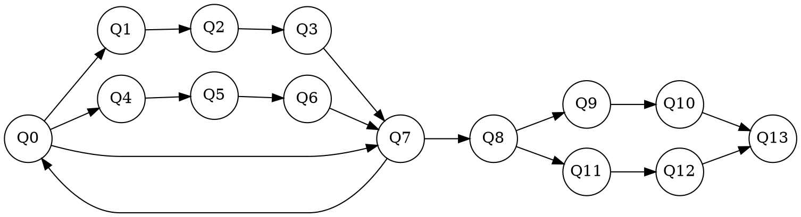

Graphvizはグラフを描画してくれる素晴らしいソフトなのだが、単体では数式を表示することができない。

## dot2tex

dot2texを利用すると、グラフのラベルに数式が使えるようになる。

次の手順でグラフを作る。

1. dot言語でグラフを書く
2. `dot2tex`でdotファイルをtexファイルに変換
3. texを使ってpdfなりsvgなりを作る。
   - pdfなら`platex + dvipdf`を使う(詳細は[別記事]()にて)
   - svgなら`platex + dvisvgm`を使う。

いやGraphviz使ってないじゃないか、と思うかもしれない。しかし[Dependensies](https://dot2tex.readthedocs.io/en/latest/installation_guide.html#dependencies)にGraphvizが含まれているから、おそらくGraphvizの描画エンジンを利用してノードの位置を決定しているのだと思う。

## インストール

Python製のソフトウェアみたいで、pip経由でインストールする。

<pre class="cui">
$ pip3 install dot2tex
</pre>

## 利用の手順

### dot言語でグラフを書く

今回は次のようにする。ファイル名は適当に`graph.dot`とする。

`texlbl`とはdot2texが読むための属性。おそらくtex labelの略で、これがnodeまたはedgeのラベルとして、texファイルに直接展開される。そのため、数式を描きたいなら`$`で囲む。もしdotファイル上にlabel属性が定義されていたら、`texlbl`の内容に上書きされる。

edgeに対して`texlbl`を使いたいなら、ダミー用の`label`属性をつける必要がある。これをやらないとラベルが表示されないので注意([参考](https://dot2tex.readthedocs.io/en/latest/usage_guide.html#labels))。しかも、**ダミーに指定するlabelの内容は空文字では駄目で、空白でも良いから1文字以上の文字列を指定する必要がある。** これが分からなくて数十分はまっていた。

### texに変換

<pre class="cui">
$ dot2tex graph.dot > graph.tex
</pre>

### svgに変換

<pre class="cui">
$ platex graph.tex
$ dvisvgm graph.dvi
</pre>

他にも、一旦pdfに変換してから`pdftocairo`を使ってsvgに変換するのもあり。

出来上がった画像がこちら。



良い感じ。

## 参考

- [dot2tex](https://dot2tex.readthedocs.io/en/latest/)
- [Graphviz](https://www.graphviz.org)
