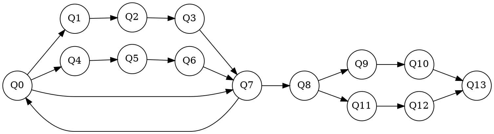

TeXのレポートに貼り付けたいが、TeXではSVG形式は扱えないのでPDFにしたくなった。やってみたら思ったより面倒だったので備忘録として残す。

### dotファイルの用意

前回と同じにする。ファイル名は`graph.dot`とする。

## dot &rarr; tex

<pre class="cui">
$ dot2tex graph.dot > graph.tex
</pre>

## tex &rarr; pdf

### 駄目なパターン

<pre class="cui">
$ platex graph.tex
$ dvipdf graph.dvi
</pre>

これをやると、一部が画面からはみ出したグラフが作成されてしまう。

### 調査

`graph.tex`のプリアンブルを見てみる。


\documentclass{standalone}
\usepackage[x11names, svgnames, rgb]{xcolor}
\usepackage[utf8]{inputenc}
\usepackage{tikz}
\usetikzlibrary{snakes,arrows,shapes}
\usepackage{amsmath}

\begin{document}
  \pagestyle{empty}

  \enlargethispage{100cm}
  ...


`documentclass`が`article`になっている。この設定だと、pdfのサイズがA4になる。enlargethispageでサイズを広げているようだが、なぜかうまくいっていないようだ。

`article`を`standalone`に変えてみる。`standalone`のときは`enlargethispage`が使えないようなので、削除する。


\documentclass{standalone}
\usepackage[x11names, svgnames, rgb]{xcolor}
\usepackage[utf8]{inputenc}
\usepackage{tikz}
\usetikzlibrary{snakes,arrows,shapes}
\usepackage{amsmath}

\begin{document}
  \pagestyle{empty}
  ...


これでもう一度次のコマンドを打つと、綺麗なpdfが作成される。

<pre class="cui">
$ platex graph.tex
$ dvipdf graph.dvi
</pre>

### 自動化

いちいち`standalone`に変えて`enlargepagesize`を削除するのは面倒なので、シェルスクリプトにまとめる。

例えば以下の内容を`dot2pdf.sh`として保存する。


dot2tex $1.dot > $1.tex
cat $1.tex\
  | sed 's/\\documentclass{article}/\\documentclass{standalone}/'\
  | sed 's/\\enlargethispage.*//' \
  > $1.tex
platex $1.tex
dvipdf $1.dvi


`graph.dot`と同じディレクトリに置いて、次のコマンドを実行すれば、dotからpdfが一気に作成される。

<pre class="cui">
$ sh dot2pdf.sh graph
</pre>
