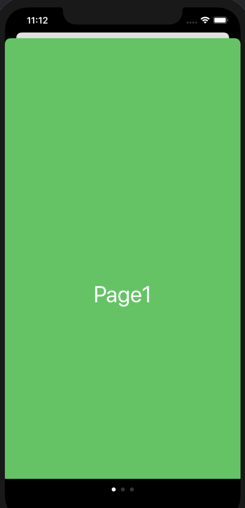
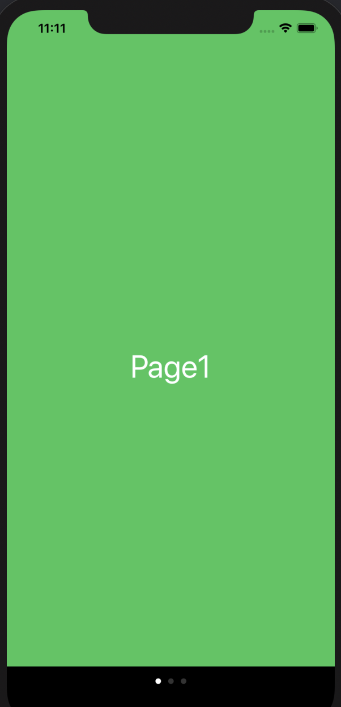

## 目標

ウォークスルーっぽいものを作る。

- メイン画面でボタンを押すとウォークスルー画面に飛ぶ。
- ウォークスルー画面では、左右にスワイプすると画面が移動する。
- 画面下に、何ページかを教えてくれる白丸(Page Control)を配置する。

## 登場物

- `Main.storyboard`と`ViewController.swift`
- `Walkthrough.storyboard`と`PageViewController.swift`

## 準備

上に書いたものをとりあえず全て作る。ただし、`PageViewController`のサブクラスは`UIPageViewController`であることに注意。

### Main.storyboard

ボタンを一つ作っておく。

### Walkthrough.storyboard

配置を次のようにする



- Page View Controllerのidentifierは`walk`とする。また、classを`PageViewController`にする。
- "Page1"と書かれたViewControllerのidentifierは`page1`とする。
- "Page2"と書かれたViewControllerのidentifierは`page2`とする。
- "Page3"と書かれたViewControllerのidentifierは`page3`とする。

以下で、Transition Styleを"Scroll"とする。もし"Page Curl"とした場合は、ページをめくるようなアニメーションになる。その代わりにPage Controlが表示されない。



## PageViewController.swift

次のように書く。


class PageViewController: UIPageViewController {

    var controllers: [UIViewController] = []
    
    override func viewDidLoad() {
        super.viewDidLoad()

        // Do any additional setup after loading the view.
        
        view.backgroundColor = .black
        
        let stb = storyboard!
        let page1 = stb.instantiateViewController(withIdentifier: "page1")
        let page2 = stb.instantiateViewController(withIdentifier: "page2")
        let page3 = stb.instantiateViewController(withIdentifier: "page3")
        controllers = [page1, page2, page3]
        
        setViewControllers([controllers[0]], direction: .forward, animated: true, completion: nil)
        dataSource = self
    }
    

    /*
    // MARK: - Navigation

    // In a storyboard-based application, you will often want to do a little preparation before navigation
    override func prepare(for segue: UIStoryboardSegue, sender: Any?) {
        // Get the new view controller using segue.destination.
        // Pass the selected object to the new view controller.
    }
    */

}

extension PageViewController: UIPageViewControllerDataSource {
    func pageViewController(_ pageViewController: UIPageViewController, viewControllerBefore viewController: UIViewController) -> UIViewController? {
        if let index = controllers.firstIndex(of: viewController), index-1 >= 0 {
            return controllers[index-1]
        } else {
            return nil
        }
    }
    
    func pageViewController(_ pageViewController: UIPageViewController, viewControllerAfter viewController: UIViewController) -> UIViewController? {
        if let index = controllers.firstIndex(of: viewController), index+1 < controllers.count {
            return controllers[index+1]
        } else {
            return nil
        }
    }
    func presentationCount(for pageViewController: UIPageViewController) -> Int {
        return controllers.count
    }
    
    func presentationIndex(for pageViewController: UIPageViewController) -> Int {
        return 0
    }
}


### 説明

`UIPageViewController`は次のように利用する。

- `setViewControllers`でページをセットする。
- `UIPageViewControllerDataSource`で定義されたメソッド`func pageViewController(...)`を実装して、前ページ、後ページのViewが誰なのかを教える。これによって、スワイプした時にページが切り替わるようになる。
- `UIPageViewControllerDataSource`で定義されたメソッド`presentationCount/presentationIndex`を実装して、現在何ページ目なのかを教える。これによって、何ページ目なのかがPageControlによってわかるようになる。

## ViewController.swift

次のように書く。Segueを利用しないで遷移する場合は、以下のように`present`メソッドを利用する。


class ViewController: UIViewController {

    override func viewDidLoad() {
        super.viewDidLoad()
        // Do any additional setup after loading the view.
    }

    @IBAction func buttonTapped(_ sender: Any) {
        let stb = UIStoryboard(name: "Walkthrough", bundle :nil)
        let pageVC = stb.instantiateViewController(withIdentifier: "walk")
        pageVC.modalPresentationStyle = .currentContext
        present(pageVC, animated: true, completion: nil)
    }
    
}


`pageVC.modalPresentationStyle = .currentContext`とすると、遷移元のViewを覆う形でViewが配置される。

以下はその設定の比較。左は未設定の場合で、右は`.currentContext`を設定した場合。未設定の場合は、`.automatic`が設定されている。`.automatic`は多くの場合`.pageSheet`というスタイルになっているらしい。

<figure>

</figure>

## 参考

- [UIPageViewController - Apple Developer Documentation](https://developer.apple.com/documentation/uikit/uipageviewcontroller)
- [Swift5 UIPageViewControllerの使い方](https://qiita.com/abouch/items/53d570ec35a451f1074a)
- [今さらUIPageViewController詳解 - しおめも](https://scior.hatenablog.com/entry/2019/04/01/201738)
- [PageViewControllerとPageControl - すいすいSwift](https://swiswiswift.com/2018-06-21/)
