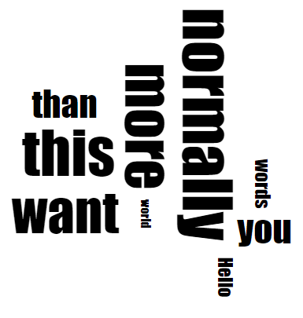
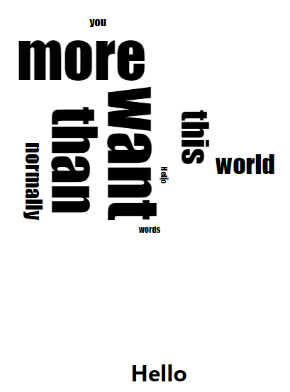
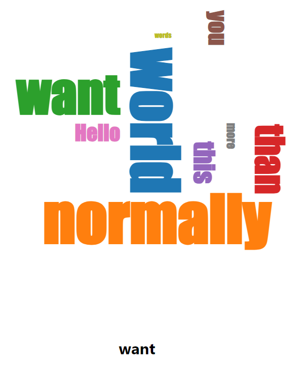

## 注意

- 筆者はReact歴1週間なので、筋の良い書き方でなかったり、間違った書き方であったりするかもしれない。
- 前半は車輪の再発明をしてしまっている。書いている途中に[react-d3-cloud](https://github.com/Yoctol/react-d3-cloud)ライブラリの存在に気づいたので、記事の最後にサンプルコードを記載している。

## プロジェクト準備

このあたりは人によりけりだが、ここでは次のようにする。

- Reactのビルド環境はDockerないしDocker Composeで構築。
- Reactのプロジェクトは`create-react-app`で構築。

それではまずDocker・Docker Composeの構築から。
プロジェクトディレクトリを適当に作成し、そこに`docker-compose.yaml`を書く。

```yaml
version: "3.0"
services:
  app:
    image: node:20-slim
    volumes:
      - ./app:/src
    ports:
      - 3000:3000
    command: npm start
    working_dir: /src
```

続いて次のコマンドを実行して`create-react-app`を導入し、実行する。

```sh
$ docker-compose run --rm app sh -c "npm install -g create-react-app && create-react-app ."
```

これにより`app`ディレクトリが作成され、中にReactのプロジェクトが生成される。

このタイミングでD3.jsと[d3-cloud](https://github.com/jasondavies/d3-cloud)も入れておく。

```sh
docker-compose run --rm app npm install d3 d3-cloud
```

これでサーバーを起動してみると、[localhost:3000](http://localhost:3000)にアクセスできることがわかるだろう。

```sh
$ docker-compouse up
```

ちなみに現状では`app`下のディレクトリがコンテナ内のrootで作成されたため、権限の問題で中のソースコードを編集できない。
VSCodeとかだとRemote Containerという拡張を入れることで解決できるらしいが、Vimユーザの自分にとっての正しい解決策はまだ未調査。
今回は、その場しのぎで`sudo chown`を使うことで、権限を変更しておく。

## ひな形作成

`WordCloud`というコンポーネントを作成し、そこでD3.jsの要素が動かせるかどうか確かめてみる。

`App.js`を次のようにする。

```jsx
import './App.css';
import WordCloud from './component/WordCloud'


function App() {
  return (
    <div className="App">
      <WordCloud />
    </div>
  );
}

export default App;
```

`component/WordCloud.jsx`を次のようにする。

```jsx
import * as d3 from 'd3';
import { useRef, useEffect } from 'react';
import cloud from 'd3-cloud';

function WordCloud() {
  const ref = useRef()

  useEffect(() => {
    const svg = d3.select(ref.current);
    console.log(svg)
    console.log(cloud());
  }, []);

  return (
    <svg ref={ref}>
    </svg>
  );
}

export default WordCloud;
```

この時点で、デバッグコンソールにsvg要素と`d3-cloud`のオブジェクトが出力されていればOK。
D3.jsとd3-cloudも認識されているし、svg要素も取得できている。

## d3-cloudを用いたワードクラウドの描画

以下のようなコンポーネント`MyWordCloud`を作成する。

- ワードクラウドの縦、横の長さ、単語のデータ、フォントファミリーを引数にとる。
- ワードクラウドを描画してSVGとして出力する。

まず`component/WordCloud.jsx`を以下のようにする。[d3-cloudのexampleコード](https://github.com/jasondavies/d3-cloud/blob/master/examples/browserify.js)を参考に作成した。

```jsx
import * as d3 from 'd3';
import { useRef, useEffect } from 'react';
import cloud from 'd3-cloud';

const MyWordCloud = ({ width, height, data, fontFamily }) => {
  const ref = useRef()

  useEffect(() => {
    const svg = d3.select(ref.current);
    const g = svg.select('g');
    g.selectAll('text').remove();

    const draw = (words) => {
      g.selectAll("text")
        .data(words)
        .enter().append("text")
        .style("font-size", d => `${d.size}px`)
        .style("font-family", fontFamily)
        .attr("text-anchor", "middle")
        .attr("transform", d => `translate(${d.x}, ${d.y}) rotate(${d.rotate})`)
        .text(d => d.text)
    };

    const layout = cloud()
      .size([width, height])
      .words(data)
      .padding(5)
      .rotate(d => ~~(Math.random() * 2) * 90)
      .font(fontFamily)
      .fontSize(d => d.value)
      .on("end", draw);

    layout.start();
  }, []);

  return (
    <svg ref={ref} width={width} height={height}>
      <g transform={`translate(${width/2}, ${height/2})`}>
      </g>
    </svg>
  );
};

export default MyWordCloud;
```

簡単にわかる範囲だけ書くと、

- `cloud()`でワードクラウドのオブジェクトを生成し、メソッドチェーンでいろいろ設定をしていく。
- ワードクラウドオブジェクトの`words`メソッドにデータを指定する。これは`{ text }`を持った配列とする。
- ワードの大きさは`fontSize`で指定する。今回はデータに`value`属性を持たせているので、それを指定する。
- ワードクラウドオブジェクトの`start`でワードクラウドを生成する。
- 終了時するときに`end`イベントが発火するため、そのリスナを`on`メソッドで指定する。
- `end`イベントのリスナの引数は`{text, size, x, y, rotate}`を持った配列。これらの情報を使ってSVG要素をよしなに生成していけばよい。 
- ReactのStrictModeの影響で`useEffect`が2回起こる。その際1回目に生成されてしまったワードクラウドを削除するために、`g.selectAll('text').remove()`を実行している。
  これをやらないとDOMで表示されている要素と実際にDOMと結びついている要素とが食い違い、後の節「クリック時の反応の実装」でおかしなことになるので注意。
  `remove`をしなくても、D3.jsの[enter/update/exit](https://bost.ocks.org/mike/selection/#enter-update-exit)のうちupdateを変更するよううまく書けば良いのだが、流れを分かりやすくするため今回は割愛。

となっている。

そして`App.js`は以下のようにする。`<WordCloud />`を追加した。`SAMPLE_WORDS`は[d3-cloudのexampleコード](https://github.com/jasondavies/d3-cloud/blob/master/examples/browserify.js)のものと同じ。

```jsx
import './App.css';
import { useState } from 'react'
import MyWordCloud from './component/WordCloud'

const SAMPLE_WORDS = [ "Hello", "world", "normally", "you", "want", "more", "words", "than", "this"]
  .map(d => ({text: d, value: 10 + Math.random() * 90}));

function App() {
  return (
    <div className="App">
      <MyWordCloud 
         width={500}
         height={500}
         data={SAMPLE_WORDS}
         fontFamily="Impact" />
    </div>
  );
}

export default App;
```

うまくいくと以下のようなページが出力される。



## クリック時の反応の実装

クリックしたら、別のコンポーネントにクリックした内容を出力させてみる。

方針としては、`[clickedWord, setClickedWord]`を`useState`で生成しておき、テキストがクリックされたときに`setClickedWord`を呼び出すようにする。`clickedWord`は別のコンポーネントに読み取らせて描画する。

まず`component/WordCloud.jsx`の`WordCloud`関数を次のようにする。`onWordClick`を追加しただけ。

```jsx
const MyWordCloud = ({ width, height, data, fontFamily, onWordClick }) => {
  // 中略
}
```

まず`component/WordCloud.jsx`の`draw`関数を次のようにする。`style`と`on('click', ...)`を追加した。

```jsx
const draw = (words) => {
  g.selectAll("text")
    .data(words)
    .enter().append("text")
    .style("font-size", d => `${d.size}px`)
    .style("font-family", FONT_FAMILY)
    .attr("text-anchor", "middle")
    .attr("transform", d => `translate(${d.x}, ${d.y}) rotate(${d.rotate})`)
    .text(d => d.text)
    .style('cursor', 'pointer')
    .on('click', onWordClick);
};
```

最後に、`App.js`を次のようにする。こちらは`ClickedWord`コンポーネントを作成し、`App`に設定した。

```jsx
import './App.css';
import { useState } from 'react'
import MyWordCloud from './component/WordCloud'

const SAMPLE_WORDS = [ "Hello", "world", "normally", "you", "want", "more", "words", "than", "this"]
  .map(d => ({text: d, value: 10 + Math.random() * 90}));

const ClickedWord = ({ word }) => {
  return (<h1>{ word }</h1>);
};

function App() {
  const [clickedWord, setClickedWord] = useState()
  const onWordClick = (e, { text }) => {
    setClickedWord(text);
  }

  return (
    <div className="App">
      <MyWordCloud 
         width={500}
         height={500}
         data={SAMPLE_WORDS}
         onWordClick={onWordClick}
         fontFamily="Impact" />
      <ClickedWord word={clickedWord}/>
    </div>
  );
}

export default App;
```

うまくいくと以下のようなページが出力される。



## react-d3-cloudを用いたワードクラウドの描画

上記を書いた後に気づいたが、同じことをやってくれるものとして[react-d3-cloud](https://github.com/Yoctol/react-d3-cloud)があった。

これを用いると、クリックした処理を実装したワードクラウドは以下のように書ける。

```jsx
import './App.css';
import { useState, useCallback, useMemo } from 'react'
import WordCloud from 'react-d3-cloud';

const SAMPLE_WORDS = [ "Hello", "world", "normally", "you", "want", "more", "words", "than", "this"]
  .map(d => ({text: d, value: 10 + Math.random() * 90}));

const ClickedWord = ({ word }) => {
  return (<h1>{ word }</h1>);
};


function App() {
  const [clickedWord, setClickedWord] = useState()

  const onWordClick = useCallback((e, { text }) => {
    setClickedWord(text);
  }, []);
  const fontSize = useCallback((word) => word.value, []);
  const rotate = useCallback((word) => ~~(Math.random() * 2) * 90, []);

  return (
    <div className="App">
      <WordCloud 
        data={SAMPLE_WORDS}
        font="Impact"
        fontWeight="bold"
        fontSize={fontSize}
        rotate={rotate}
        padding={5}
        random={Math.random}
        onWordClick={onWordClick}
      />
     <ClickedWord word={clickedWord} />
    </div>
  );
}

export default App;


```

個人的なハマりポイントは`useCallback`を使う点。これを行わないと、クリックのたびに`clickedWord`の変更を検知してしまい再レンダーされてしまう。
[README](https://github.com/Yoctol/react-d3-cloud#how-to-avoid-unnecessary-re-render)によると`<WordCloud>`は`React.memo`を使っているらしいので、
propsの変更がなければ再レンダーされない。そのため、コールバック関数の再生成を防ぐため`useCallback`を使っている。


